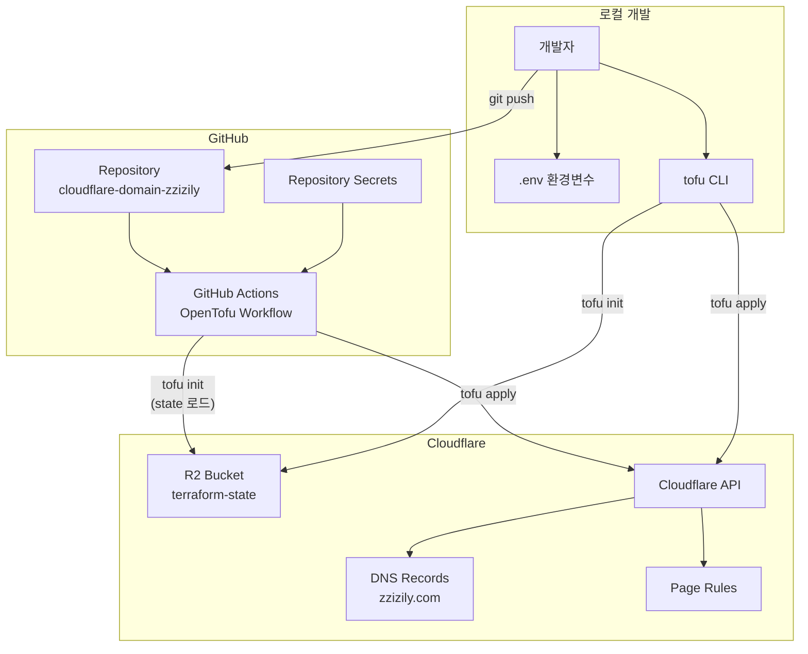
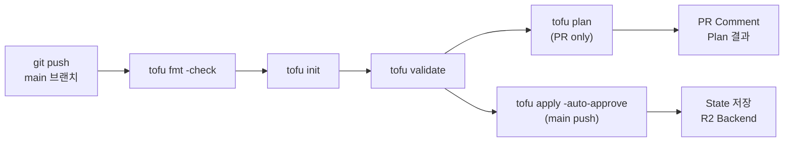
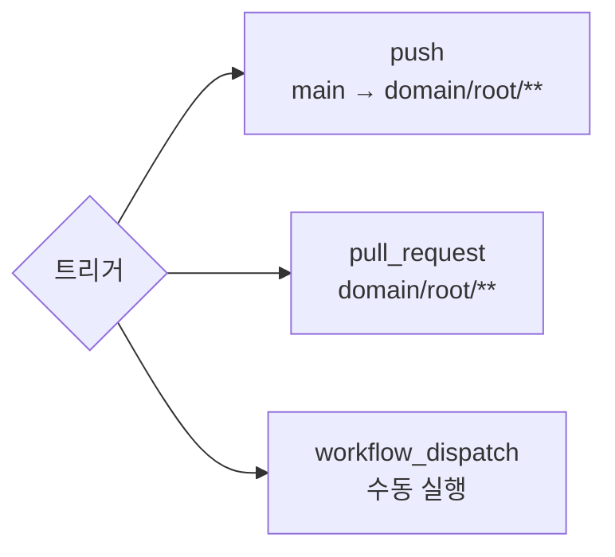

# zzizily.com

[](https://github.com/deuxksy/cloudflare-domain-zzizily/actions/workflows/tofu.yml)

Cloudflare DNS 관리 - OpenTofu + R2 Backend

## 아키텍처



## CI/CD 파이프라인





## 프로젝트 구조

```
├── .github/workflows/
│   └── tofu.yml              # CI/CD 워크플로우
├── domain/root/
│   ├── main.tf               # Backend + Provider + Variables (통합)
│   ├── page-rule.tf          # Page Rule (zzizily.com → GitHub 301)
│   ├── record-a.tf           # A 레코드 (local, ddns-netgear)
│   ├── record-cname.tf       # CNAME 레코드 (tech → GitHub Pages)
│   ├── record-ddns.tf        # DDNS 레코드 (Netgear 공유기)
│   ├── record-google.tf      # Google 서비스 (blog, mail, drive 등)
│   ├── record-mail.tf        # MX 레코드 (Google Workspace)
│   ├── record-ns.tf          # NS 레코드 (netgear 서브도메인)
│   └── record-ssl.tf         # SSL 인증 (ACME challenge)
├── .env.example              # 환경 변수 템플릿
└── docs/                     # 설계 문서
```

## 시작하기

```bash
# 1. .env 복사 후 값 입력
cp .env.example .env

# 2. OpenTofu 초기화
source .env && cd domain/root && tofu init

# 3. 변경 사항 확인
source .env && cd domain/root && tofu plan

# 4. 적용
source .env && cd domain/root && tofu apply
```

## 환경 변수

| 변수 | 설명 |
|------|------|
| `AWS_ACCESS_KEY_ID` | R2 접근용 Access Key |
| `AWS_SECRET_ACCESS_KEY` | R2 접근용 Secret Key |
| `TF_VAR_cloudflare_api_token` | Cloudflare API Token |
| `TF_VAR_cloudflare_zone_id` | Cloudflare Zone ID |
| `TF_VAR_cloudflare_domain` | 도메인 (zzizily.com) |

## GitHub Secrets

| Secret | 설명 |
|--------|------|
| `AWS_ACCESS_KEY_ID` | R2 Backend 접근용 |
| `AWS_SECRET_ACCESS_KEY` | R2 Backend 접근용 |
| `CLOUDFLARE_API_TOKEN` | Cloudflare API Token |
| `CLOUDFLARE_ZONE_ID` | Cloudflare Zone ID |
| `CLOUDFLARE_DOMAIN` | 도메인 |
| `CLOUDFLARE_ACCOUNT_ID` | Cloudflare Account ID |
